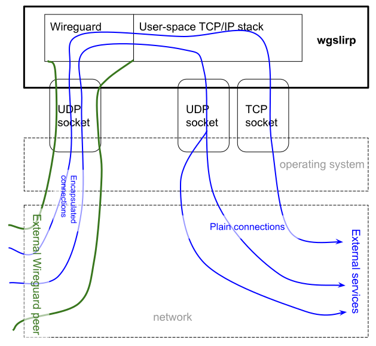

# wgslirpy

A command line tool (and a Rust library) for accepting incoming connections within a Wireguard link and routing them to external network using usual opeating system's socket API.  
This allows creating a sort of VPN server without root access, e.g. from Android app or when using unprivileged containers.



## Features

* Maintaining Wireguard connection with one peer, using [Boringtun](https://github.com/cloudflare/boringtun) library.
* Decoding incoming TCP or UDP connections using [smoltcp](https://github.com/smoltcp-rs/smoltcp) library
* Forwarding TCP and UDP connections from Wireguard to external world, exchanging traffic between userspace and real sockets.
* For UDP, hole punching / NAT traversal should work (not tested though)
* For TCP, half-closed connections and backpressure should work
* Crude DNS server for resolving IPv4 and IPv6 addresses using host's name resolution mechanism.
* Reverse mode for specific TCP and UDP ports - forwarding connections from host to Wireguard.

## Limitations

* No ICMP (except of pings to specific address for testing). This affects UDP's "port unreachable"s.

## Demo session

<details><summary>Setup</summary>

```
peer# wg genkey
4Khaa5tgPI9NJsO2R896Yd6748k9fW4aapGZnIcUM14=
peer# wg pubkey <<< 4Khaa5tgPI9NJsO2R896Yd6748k9fW4aapGZnIcUM14=
rPpCjWzIv/yAtZZi+C/pVprie8D0QaGlPtJXlDi6bmI=

gateway$ wg genkey
SG43Zi0wGp4emfJ/XpTnnmtnK8SSjjIHOc3Zh37c928=
gateway$ wg pubkey <<< SG43Zi0wGp4emfJ/XpTnnmtnK8SSjjIHOc3Zh37c928=
MR2RF5Tp+6BKt9k+deKg1GqR3re3ckJKti+uwZA84DU=

peer# ip link add wgslirpyspeer type wireguard
peer# wg set wgslirpyspeer listen-port 9796 private-key <(echo 4Khaa5tgPI9NJsO2R896Yd6748k9fW4aapGZnIcUM14=) peer MR2RF5Tp+6BKt9k+deKg1GqR3re3ckJKti+uwZA84DU= allowed-ips 0.0.0.0/0,::/0
peer# ip netns add testing-wgslirp
peer# ip link set wgslirpyspeer netns testing-wgslirp
peer# ip netns exec testing-wgslirp ip link set wgslirpyspeer up
peer# ip netns exec testing-wgslirp ip addr add 192.168.76.1/32 dev wgslirpyspeer
peer# ip netns exec testing-wgslirp ip addr add fc00::01/128 dev wgslirpyspeer
peer# ip netns exec testing-wgslirp route -4 add default dev wgslirpyspeer
peer# ip netns exec testing-wgslirp route -6 add default dev wgslirpyspeer
peer# mkdir -p /etc/netns/testing-wgslirp
peer# echo nameserver 192.168.72.2 > /etc/netns/testing-wgslirp/resolv.conf
```
</details>

<details><summary>Activation</summary>

```
gateway$ RUST_LOG=debug wgslirpy --private-key SG43Zi0wGp4emfJ/XpTnnmtnK8SSjjIHOc3Zh37c928= -b 127.0.0.1:9797 --peer-key rPpCjWzIv/yAtZZi+C/pVprie8D0QaGlPtJXlDi6bmI= --peer-endpoint 127.0.0.1:9796 --keepalive-interval 10 --dns 192.168.72.2:53 --pingable 192.168.72.2
DEBUG boringtun::noise: Sending handshake_initiation
DEBUG boringtun::noise: Received handshake_response local_idx=1 remote_idx=2743606023
DEBUG boringtun::noise: New session session=1
DEBUG boringtun::noise: Sending keepalive

peer# ip netns exec testing-wgslirp wg
interface: wgslirpyspeer
  public key: rPpCjWzIv/yAtZZi+C/pVprie8D0QaGlPtJXlDi6bmI=
  private key: (hidden)
  listening port: 9796

peer: MR2RF5Tp+6BKt9k+deKg1GqR3re3ckJKti+uwZA84DU=
  endpoint: 127.0.0.1:9797
  allowed ips: 0.0.0.0/0, ::/0
  latest handshake: 46 seconds ago
  transfer: 340 B received, 92 B sent
```
</details>

<details><summary>Testing</summary>

```
peer# # ip netns exec testing-wgslirp ping -c 2 192.168.72.2
64 bytes from 192.168.72.2: icmp_seq=1 ttl=64 time=0.705 ms
64 bytes from 192.168.72.2: icmp_seq=2 ttl=64 time=0.435 ms

gateway$ 
INFO wgslirpy::router: New NAT entry for Pingable
DEBUG wgslirpy::router: Finished serving Pingable

peer# ip netns exec testing-wgslirp curl http://example.com/
<!doctype html>
...
</html>

gateway$
DEBUG wgslirpy::router::serve_dns: DNS query example.com:0
DEBUG wgslirpy::router: Sending DNS reply

INFO wgslirpy::router: New NAT entry for Tcp { client_side: Endpoint { addr: Ipv4(Address([192, 168, 76, 1])), port: 48004 }, external_side: Endpoint { addr: Ipv4(Address([93, 184, 216, 34])), port: 80 } }
DEBUG wgslirpy::router::serve_tcp: Connected to upstream TCP
DEBUG wgslirpy::router::serve_tcp: Accepted the connection
DEBUG wgslirpy::router::serve_tcp: EOF received from client
DEBUG wgslirpy::router::serve_tcp: Shutdown finished
DEBUG wgslirpy::router::serve_tcp: EOF
DEBUG wgslirpy::router::serve_tcp: Client TCP socket no longer active
DEBUG boringtun::noise::timers: KEEPALIVE(PERSISTENT_KEEPALIVE)
DEBUG wgslirpy::router: Finished serving Tcp { client_side: Endpoint { addr: Ipv4(Address([192, 168, 76, 1])), port: 48004 }, external_side: Endpoint { addr: Ipv4(Address([93, 184, 216, 34])), port: 80 } }

peer# ip netns exec testing-wgslirp dig +short github.com @8.8.8.8
140.82.112.3

gateway$
01:26:14 INFO wgslirpy::router: New NAT entry for Udp
...
01:27:46 DEBUG wgslirpy::router::serve_udp: Timed out a UDP connection
```
</details>

## Installation

Download a pre-built executable from [Github releases](https://github.com/vi/wgslirpy/releases) or install from source code with `cargo install --path .`  or `cargo install wgslirpy`.

## CLI options

<details><summary> wgslirpy --help output</summary>

```
Usage: wgslirpy [-k <private-key>] [-f <private-key-file>] -K <peer-key> [-p <peer-endpoint>] [-a <keepalive-interval>] -b <bind-ip-port> [-D <dns>] [-P <pingable>] [--mtu <mtu>] [--tcp-buffer-size <tcp-buffer-size>] [--transmit-queue-capacity <transmit-queue-capacity>] [-u <incoming-udp...>] [-t <incoming-tcp...>]

Expose internet access without root using Wireguard

Options:
  -k, --private-key main private key of this Wireguard node, base64-encoded
  -f, --private-key-file
                    main private key of this Wireguard node (content of a
                    specified file), base64-encoded
  -K, --peer-key    peer's public key
  -p, --peer-endpoint
                    address of the peer's UDP socket, where to send keepalives
  -a, --keepalive-interval
                    keepalive interval, in seconds
  -b, --bind-ip-port
                    where to bind our own UDP socket for Wireguard connection
  -D, --dns         use this UDP socket address as a simple A/AAAA-only DNS
                    server within Wireguard network
  -P, --pingable    reply to ICMP pings on this single address within Wireguard
                    network
  --mtu             maximum transfer unit to use for TCP. Default is 1420.
  --tcp-buffer-size in-application socket TCP buffer size. Note that operating
                    system socket buffer also applies.
  --transmit-queue-capacity
                    nubmer of outgoing (to wireguard) packets to hold in a queue
  -u, --incoming-udp
                    forward this host UDP port into Wireguard network. You need
                    to specify triplet of socket addresses: host, source
                    (optional) and dest. Host address is address to bind
                    operating system socket to. source and dest addreses are
                    used within Wireguard network. Example: -u
                    0.0.0.0:1234,10.0.2.1:1234,10.0.2.15:1234
  -t, --incoming-tcp
                    forward this host TCP port into Wireguard network. You need
                    to specify triplet of socket addresses: host, source
                    (optional) and dest. Host address is address to bind
                    operating system socket to. source and dest addreses are
                    used within Wireguard network. If source port is 0,
                    roundrobin is used. Example: -t 0.0.0.0:1234,,10.0.2.15:1234
  --help            display usage information
```
</details>

## Wireguardless (GUE/FOU) mode

You can opt out Wireguard layer using special keywords `INSECURE` and `GUE` as local and peer keys respectively.
This way wgslirpy would just send IPv4/IPv6 packets directly as UDP datagrams.

<details><summary>Example session</summary>

```
gateway$ wgslirpy -k INSECURE -K GUE -b 127.0.0.1:6556 --dns 10.0.2.1:53 -P 10.0.2.1
peer# ip fou add port 6555 gue local 127.0.0.1 peer 127.0.0.1 peer_port 6556 dev lo
peer# ip link add guegue type sit remote 127.0.0.1 local 127.0.0.1 encap gue encap-sport 6555 encap-dport 6556 encap-csum
peer# ip link set guegue netns testing-wgslirp
peer# ip netns exec testing-wgslirp ip link set guegue up
peer# ip netns exec testing-wgslirp ip addr add 10.0.2.15/24 dev guegue
peer# ip netns exec testing-wgslirp ip route add default dev guegue
peer# ip netns exec testing-wgslirp ping 10.0.2.1
64 bytes from 10.0.2.1: icmp_seq=4 ttl=64 time=2.53 ms
...
```

You can also use simpler mode with `ipip` and `fou` instead of `sit` and `gue`, but that wouldn't support IPv6.

</details>

## See also

* [onetun](https://github.com/aramperes/onetun) - Similar idea, but is designed to forward connections _to_ Wireguard instead of _from_ Wireguard.
* [SLiRP](https://en.wikipedia.org/wiki/Slirp) - Similar idea, but with PPP (a stream-based connection) instead of packet-based Wireguard.
